class: center, middle

## Analysis: Twitter
Eric Sorell, Dec 2016

???
Minimalism

Introduce yourself.
* Eric Sorell
* Bachelors In Science, Mathematics (abstract algebra focus)

---
class: center, middle
## Project Objective

???
Introduce the project.
* "Do Some Interesting Data Analysis"
* 30 minutes + 30min Q&A
* Start to finish, 2 weeks
* Demonstrate ability to explain ideas to clients.
---
layout: true

## Initial Approach

.topbox[
* Twitter is interesting, I'll get data from there
* Multiple Linear Regressions are interesting, I'll do one of those
* Scatterplots are interesting, I'll use them
]
---
class: center, middle

???
I had some ideas right off the bat, and structured the project around those ideas, so let's cover those ideas and that structure.
---

Twitter provides lots of data to developers with an API accessible via various open source libraries.

https://dev.twitter.com/streaming/public
<br>
https://github.com/dghubble/go-twitter/twitter

Filter used:
* Not a Retweet
* Geographic coordinates provided
* Located within the continental US
* English language
???
I quickly set up a program to monitor and record the stream of tweets.

Not all tweets, 'random sample' that matches a filter

---
Information monitored and recorded:
* Tweet geographic coordinates
* Tweet post date
* Number of links in tweet content
* List of words in tweet content
* Poster unique numeric ID
* Poster creation date
* Poster follower count
* Poster Tweet count

???
Recording went from a few days after the project's start, to a few days before it's end.  There were one or two outages for a few hours, but basically a little over a week's worth of tweets were collected (1644590 tweets).

Samples of various sizes of this data were used during the development of the analysis phase; final analysis numbers and plots used the whole dataset.

I didn't know exactly _what_ I wanted to analyse, hence 'development of analysis'.  Lots of ways to process this data.

---
Initial Goals for Multiple Linear Regression:
* Find some interesting relationships between properties of the data
* Demonstrate 'controlling for confounding variables'
* Make some predictions

???
I was able to get my code running multiple linear regressions pretty easily.  Go has a dedicated team of scientists who have put together (and still work on) a good set of libraries for data analysis, matrix math.

It was no "x <-lm(data~.)", though.  I've never used R before so I used Go for this project, to stay on familiar ground, but after watching several stats lectures where they just wave R at the problem and it falls over, I have grown jealous.

Value in this investigation: gaining an appreciation for different numerical methods for handling various stats concepts.  Having to code dive to see if I'm using a Gram-Schimdt or a Householder QR decomposition, and why it matters (numerical stability), was a learning experience.
---
Examination of different properties of the data for linear relationships focused on:
* Number of followers
<br> <br>
* Tweet count
* Number of words used
* Number of links used
* Distance from nearest major US city (top 100)
* Population of nearest major US city

???
This was just a quick grab for some measurable and possibly related numbers so I could start building the analysis apparatus around _something_.  I had initially hoped to do some more interesting content analysis (wordnet), but quickly decided that would be a lot of work on something that would be off goal.  Like, I implimented a search of great-circle distances to top US cities and in the end don't think it added much "data analysis".

I would stick with these properties, (with some logarithmic adjustments down the road) adding "Age of posting account at time of post" near the end.

Choosing/examining goodness of data: see next slide

---
Initial scatterplots highlighting problems

.fitimg[
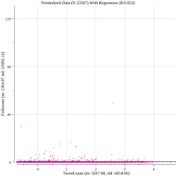
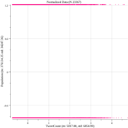
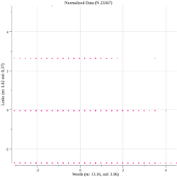
]

???
Some of my first plots. Done with gonum plotting library

Initial scatterplots of the data did their job: they showed problems!

1. Huge outliers: 120STD followers!!! (Carmilla Cabello)
2. Nonsensical data: bug in distance calculations (twitter uses Long, Lat)
3. Uninteresting plots; words and links don't have much room to vary on a plot

---
layout: true

## Development of Analysis

.topbox[
* Processing the data
* Examining model operation
* Improving visual feedback
]
---
class: center, middle

???
So, once some data was collected, some analysis were run and some plots made, I had something that worked!  The next step was to make it all _useful_.
---
title: hist_before
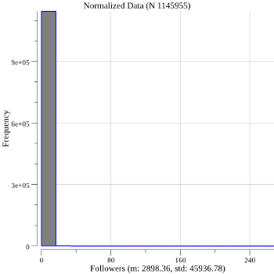
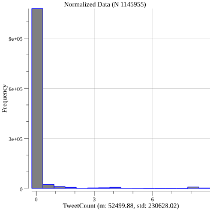

???
Histograms to better see a problem with outliers.  My first thoughts were robots and/or celebrities might be behaving quite differently from normal people, and maybe I could "filter out" them and make this an analysis only about humans.

Apologies to Stephen Fry and his 13 million followers, but >240 is too many standard deviations.
---
title: hist_after
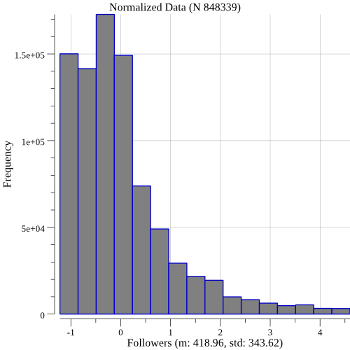
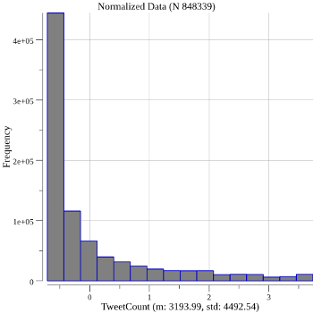

???
Some testing showed actually interesting histograms when filtering under 20,000 tweets and 2,000(!) followers.  More sophisticated filtering might have used tweets/day average instead.

We go from 1.1mil samples to 850k samples, which seems fine.
---
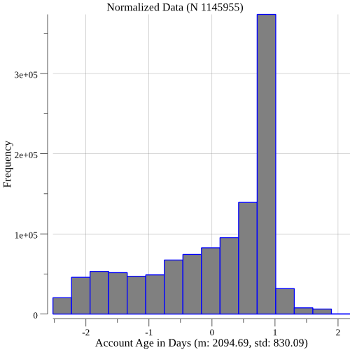
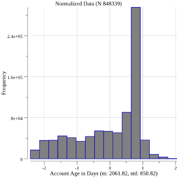
???
As a check, I looked at histograms of the other properties to see if their distribution was drastically changed by this filter, and saw no huge changes to the general shapes.  Shown here is "Age of account"
---
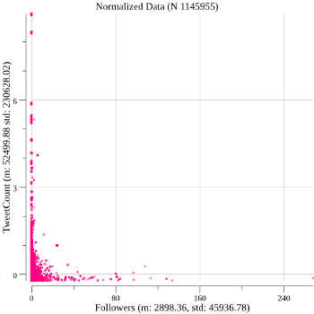
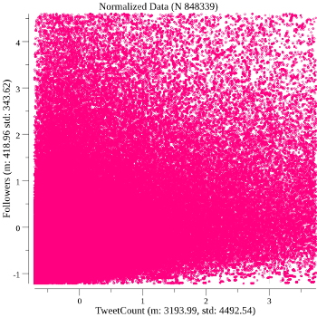
???
And the scatterplot is transformed to have some variability that we can analyze now!  A few outliers won't control the path of our fit.

This chart is overplotted, a problem I tackle later
---

Initial R<sup>2</sup> = 0.002
<br>
"Humans Filter" R<sup>2</sup> = 0.174
<br>
Power Law R<sup>2</sup> = 0.296

???
Using different combinations of our variables, and different kinds of manipulations (such as filtering), I examine the R<sup>2</sup> of different fits, while using the scatterplots to check for strange behaviors.

MeanSqResiduals 0.998   0.826   0.704

Here we see Power Law R2: Discussion next slide
---

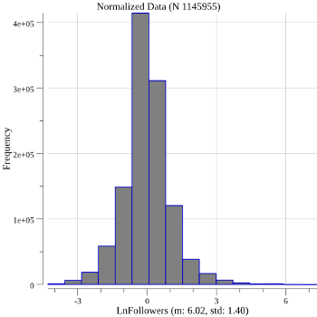
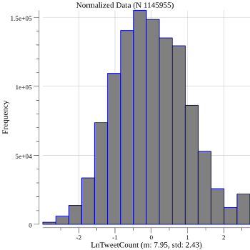

???
These graphs are what really sold me on using the natural logarithm for tweetcount and followers: such nice bell-shaped curves!  Even my human filter curve was lopsided.

I eye that bump at the end of the tweetcounts curve and again grumble in my mind about robots, but this way at least Stephen Fry gets to be part of my data set again.

---

* Number of followers  ==> ln(x)
* Tweet count          ==> ln(x)
* Number of words used
* Number of links used
* Distance from nearest major US city (top 100)    ==> Cut!
* Population of nearest major US city ==> ln(x)
* Age of Account ==> Added

???
So, the real development of our model is here, in what variables we are including in our regression.  The distance variable turned out to have a low correlation with popularity, and it's inclusion/removal did not change the other coefficients much, so for the sake of simplicity it was removed.

The bulk of my work here has been building the tooling, for data acquisition, processing, modeling, and presentation.  I think with all that tooling now in place, were I to put an equal amount of work in, most of it would be in searching out more varied sets of variables among the data.

More on wish listing later

---

```go
LnFollowers Mean: 6.011637, STD: 1.398575
Links Mean: 0.997370, STD: 0.389061
Words Mean: 13.580750, STD: 3.966365
LnTweetCount Mean: 7.941631, STD: 2.408930
LnPopulation Mean: 13.502904, STD: 1.033709
Age(days) Mean: 2101.801189, STD: 828.125819

LnFollowers = (0.000000) + (0.160706)[Links] + (0.110461)[Words] +
(0.439769)[LnTweetCount] + (0.040290)[LnPopulation] + 
(0.327982)[Age(days)]

MeanSqError: 0.704020, MeanSquareResiduals: 0.704017, R^2: 0.295982
```

???
So here's our linear regression equation, with some associated stats.

Location statistics were not good predictors of popularity.  Tweetcount was the best, age of account was close second, and both using links and wordiness were close to each other as mild predictors.
---

```r
// X1 = ("LnFollowers")
    Estimate   Std. Error   t value Pr(>|t|)
X2 0.1607064 0.0006834654 235.13464        0 // ("Links")
X3 0.1104606 0.0006731273 164.10066        0 // ("Words")
X4 0.4397685 0.0006947700 632.96998        0 // ("LnTweetCount")
X5 0.0402905 0.0006583052  61.20337        0 // ("LnPopulation")
X6 0.3279818 0.0006649358 493.25341        0 // ("DayAge")

```

???
OK, so last minute I imported the data and started poking at R's utilities.  I didn't get any good plots out of it, as I think the confidence intervals might have been too small to appear on the charts.

But I did get these T-statistics and p values (2 tailed), which actually look pretty good!  We can see again that LnPop is not as good as the rest, though still looking okay.

Test is against null hypothesis, B_i = 0, so our numbers aren't confirmed, but we have a good idea there is indeed some linear relations between these properties.

---
layout:true
class: center, middle
---
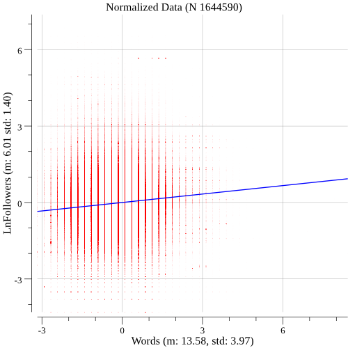
???
Okay, let's look at some pictures.  To combat overplotting (n: 1.6mil!) I've decreased the dot size to a speck, and dropped the alpha to 3(!)

Jittering might be a good idea for words/links/population

Regression line for each plot is holding all other vars at their mean (zero).
---
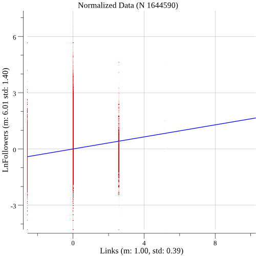
---
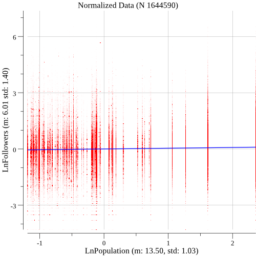
???
Population is pretty discrete: only 100 cities included.  1000 avail, but take a long time (distance calc).

I think the _lack_ of a relation here is actually interesting.
---
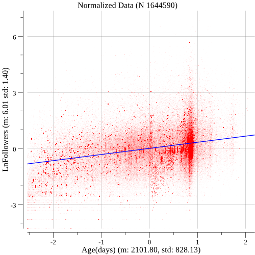
???
The age graph has one of the most interesting anomalies: the dense cloud right around 1stD age.  Who are they?
---
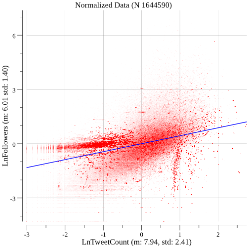
???
Here it almost looks like there's three separate groups, the cloud and the two spikes.

Maybe some color-coding of these dots for other vars would help determine if the anomalies had some other pattern
---
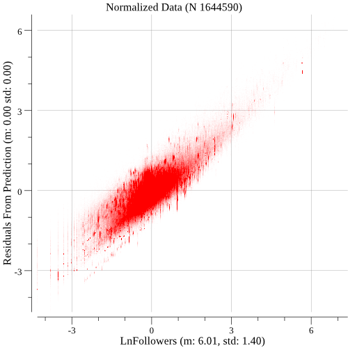
???
Lastly, a residual check for anomalies.  Looks pretty linear with a good amount of variation.
---
layout: false
class: center, middle

## Potential Improvements

.topbox[
* More robust use of R's calculating and plotting tools
* Calculation/plotting of confidence intervals for regression coefficients
* Deeper examination of hypothesis testing, discussion of effect of variable inclusions on errors
* Use content analysis to provide more properties to analyze
* Try more varied property sets to find more interesting relations
* Explore varied plotting approaches
]
???
Improvement Opportunities?  These are all things I basically half-did, but couldn't complete in time

R: Reinventing the wheel sounded cooler before I saw how awesome R's wheels are.  I have since added the ability to format my data to load into R.

Confidence intervals: I spent 7 hours going through Stats 414-415 trying to get this concept down.  I got it for simple LR, but hit a wall at Stat501 

se(y) = sqrt(MSE(Xht (Xt X)-1 Xh)).  Other lectures: "Use R to calculate this se(y).... -_-


HEY!  Since then, we've actually starting using R a bit, and gotten some p values!  Might leverage them into confidence intervals

Content analysis: wordnet is cool!  Noun/verb identification is hard

I saw a bunch of cool charts in plotting tools/walkthroughs, but didn't really have time to grok them sufficietly.

---
class: center, middle
# Q & A
.topbox[
* Eric Sorell
<br>
* Project source code available at https://github.com/sore0159/data_analysis
]

???
Even the source for this presentation itself!

